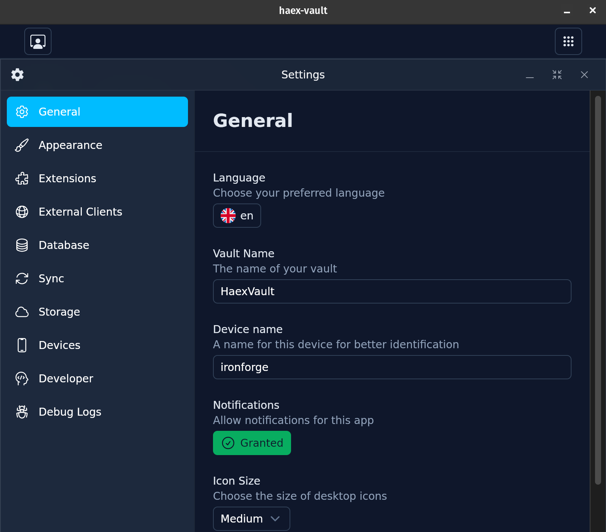
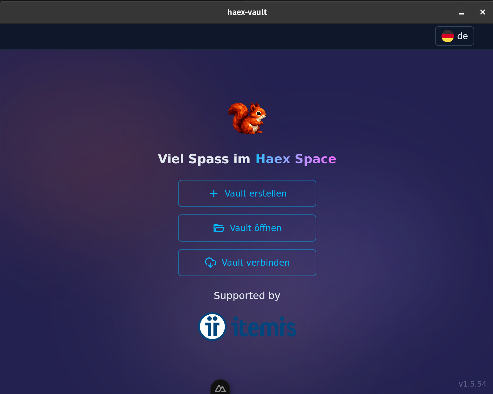

# Haex Vault

**Build once. Run everywhere. Sync automatically.**

One web app. All platforms. Local encryption and conflict-free synchronization out-of-the-box.

<p align="center">
  
  
</p>

---

## What is Haex Vault?

Haex Vault is the **core of the Haex Space ecosystem** – a runtime for web apps with native capabilities.

Think of it like Android: Haex Vault is the operating system, Haextensions are the apps.

```
                    ┌──────────────────────┐
                    │  Browser Extension   │
                    │  (e.g. Autofill)     │
                    └──────────┬───────────┘
                               │ WebSocket
                               ▼
┌─────────────────────────────────────────────────────┐
│                   Haex Space                        │
│                   (Ecosystem)                       │
│                                                     │
│  ┌─────────────────────────────────────────────┐   │
│  │              Haex Marketplace               │   │
│  │          (Discover Haextensions)            │   │
│  └─────────────────────────────────────────────┘   │
│                        │                           │
│                        ▼                           │
│  ┌─────────────────────────────────────────────┐   │
│  │               Haex Vault                    │   │
│  │            (this project)                   │   │
│  │                                             │   │
│  │  ┌─────────┐ ┌─────────┐ ┌─────────┐       │   │
│  │  │ Password│ │  Notes  │ │  Mail   │  ...  │   │
│  │  │ Manager │ │   App   │ │ Client  │       │   │
│  │  └────┬────┘ └────┬────┘ └────┬────┘       │   │
│  │       └───────────┼───────────┘            │   │
│  │                   ▼                        │   │
│  │  ┌─────────────────────────────────────┐   │   │
│  │  │  • Encrypted SQLite (SQLCipher)     │   │   │
│  │  │  • Permission System                │   │   │
│  │  │  • Native APIs                      │   │   │
│  │  │  • CRDT Sync Engine                 │   │   │
│  │  │  • WebSocket API (external)         │   │   │
│  │  └─────────────────────────────────────┘   │   │
│  └─────────────────────────────────────────────┘   │
│                        │                           │
│                        ▼ (optional)                │
│  ┌─────────────────────────────────────────────┐   │
│  │            Haex Sync Server(s)              │   │
│  │             (self-hostable)                 │   │
│  └─────────────────────────────────────────────┘   │
│                                                     │
│  Runs on: Windows │ macOS │ Linux │ Android │ iOS  │
└─────────────────────────────────────────────────────┘
```

### What does Haex Vault do?

| Task | Description |
|------|-------------|
| **Manage Haextensions** | Install, update, remove |
| **Enforce permissions** | Fine-grained control over all access |
| **Manage database** | Encrypted SQLite for all Haextensions |
| **Synchronization** | Conflict-free sync across devices and servers |
| **External interface** | WebSocket API for browser extensions and other services |

---

## For Users

**Haex Vault works offline.** No internet connection required, no account needed.

Internet is only required when:
- A Haextension needs it (e.g. mail client)
- You want to sync your data across devices

### Your Benefits

**Your data, your control**
Everything is stored locally on your device, encrypted with AES-256. You decide if and where to sync.

**Fine-grained permissions**
You control exactly what each Haextension can do:
- Which database tables?
- Which file paths?
- Which URLs?
- Which shell commands?

**Multi-device sync**
Use Haex Vault on multiple devices. Changes are automatically merged – without conflicts.

**Browser integration**
Browser extensions can communicate with Haex Vault – e.g. for password autofill. As always: only with your permission.

---

## For Developers

### The Key Benefit

You get the power of a **distributed SQL application** that syncs data across any number of clients – without having to deal with CRDTs, merge conflicts, or sync logic.

**Haex Vault handles that for you.**

### What you write

A web app. With Vue, React, Svelte, or whatever you prefer.

### What you get

- **All platforms**: Windows, macOS, Linux, Android, iOS – one codebase
- **Native APIs**: Filesystem, SQLite database, shell, notifications, ...
- **Automatic sync**: Save to the database, Haex Vault synchronizes
- **Encryption included**: Local and during sync
- **External accessibility**: Your Haextension can be accessed from outside

### Architecture

```
┌─────────────────────────────────────────────────────────┐
│                     Haex Vault                          │
│                                                         │
│  ┌─────────────────┐      ┌─────────────────────────┐  │
│  │  Haextension    │      │  External Clients       │  │
│  │  (IFrame)       │      │  (Browser Extension,    │  │
│  │                 │      │   other services)       │  │
│  └────────┬────────┘      └────────────┬────────────┘  │
│           │ postMessage                │ WebSocket     │
│           └──────────────┬─────────────┘               │
│                          ▼                             │
│  ┌──────────────────────────────────────────────────┐  │
│  │              Haex Vault Core                     │  │
│  │                                                  │  │
│  │  ┌────────────┐  ┌────────────┐  ┌───────────┐  │  │
│  │  │ Permission │  │  Database  │  │   Sync    │  │  │
│  │  │   System   │  │   (SQLite) │  │  Engine   │  │  │
│  │  └────────────┘  └────────────┘  └───────────┘  │  │
│  └──────────────────────────────────────────────────┘  │
└─────────────────────────────────────────────────────────┘
```

### Internal API (Haextensions)

Haextensions run in an isolated IFrame and communicate via postMessage:

```typescript
// In your Haextension
const result = await haex.db.query('SELECT * FROM passwords WHERE domain = ?', [domain])
const file = await haex.fs.read('/documents/notes.txt')
```

### External API (WebSocket)

External clients (e.g. browser extensions) connect via WebSocket:

```typescript
// In a browser extension
const ws = new WebSocket('ws://localhost:PORT')
ws.send(JSON.stringify({
  action: 'query',
  extension: 'password-manager',
  method: 'getCredentials',
  params: { domain: 'example.com' }
}))
```

The Haextension decides which methods to expose externally. Haex Vault enforces permissions.

### Declaring permissions

In the manifest, you specify what your Haextension needs:

```json
{
  "name": "My Password Manager",
  "permissions": {
    "database": {
      "tables": ["passwords", "categories"]
    },
    "network": {
      "urls": ["https://haveibeenpwned.com/api/*"]
    },
    "external": {
      "methods": ["getCredentials", "saveCredentials"]
    }
  }
}
```

### Publishing

Make your Haextension available to other users on the **Haex Marketplace**.

---

## Technical Details

### Offline-first

Haex Vault works completely without internet:
- All data is stored locally
- No server needed to get started
- Sync server is optional and can be added later

### Encryption

**Local**: The entire SQLite database is encrypted with SQLCipher (AES-256).

**Sync**: The payload of each row is end-to-end encrypted. Table and column names remain visible to the server so it can detect changes – but your actual data is only visible to you.

### Synchronization

Haex Vault uses CRDTs (Conflict-free Replicated Data Types):

- **Offline-first**: Changes are stored locally
- **Conflict-free**: Automatic merging without data loss
- **Multi-server**: Connect multiple sync servers (including self-hosted)
- **Add later**: Start without sync, add it when needed

### Tech Stack

- **Runtime**: [Tauri](https://tauri.app) (Rust backend, native WebViews)
- **Database**: SQLite with SQLCipher
- **Sync**: Custom CRDT implementation
- **External API**: WebSocket
- **Haextensions**: Any web technology

---

## Installation

### Downloads

Pre-built binaries: [Releases](https://github.com/haex-space/haex-vault/releases)

### Building from source

**Prerequisites:**
- [Node.js](https://nodejs.org/) + pnpm
- [Rust](https://www.rust-lang.org/tools/install)
- [Tauri Prerequisites](https://tauri.app/start/prerequisites/)

**Linux (Debian/Ubuntu):**
```bash
sudo apt install libwebkit2gtk-4.1-dev libgtk-3-dev libayatana-appindicator3-dev librsvg2-dev
```

**Linux (Fedora):**
```bash
sudo dnf install webkit2gtk4.1-devel gtk3-devel libappindicator-gtk3 librsvg2-devel
```

**Start development:**
```bash
git clone https://github.com/haex-space/haex-vault.git
cd haex-vault
pnpm install
pnpm tauri dev
```

**Create a release:**
```bash
pnpm release:patch  # 1.0.0 → 1.0.1
pnpm release:minor  # 1.0.0 → 1.1.0
pnpm release:major  # 1.0.0 → 2.0.0
```

---

## Haex Space Ecosystem

| Project | Description |
|---------|-------------|
| **Haex Vault** | The runtime (this repo) |
| **Haex Sync Server** | Self-hostable sync server |
| **Haex Marketplace** | Platform for Haextensions |
| **Haextensions** | The apps (Password Manager, Notes, ...) |

---

## License

[MIT](LICENSE)
