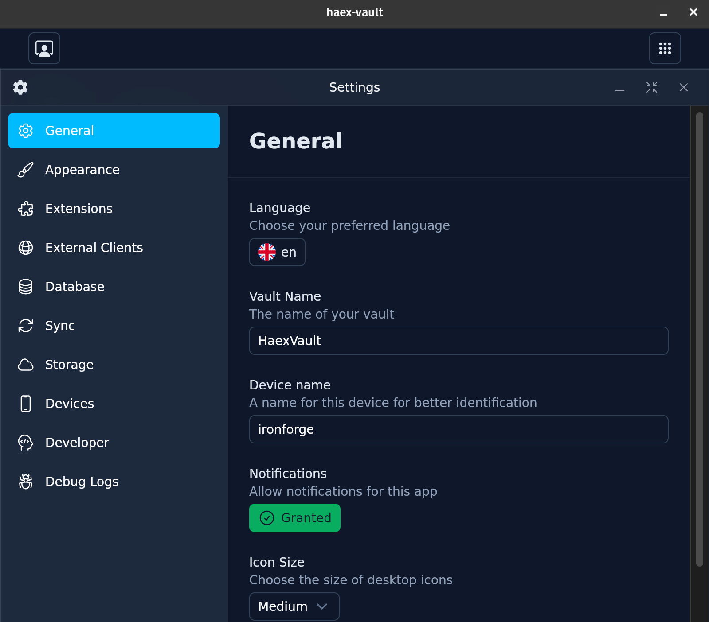
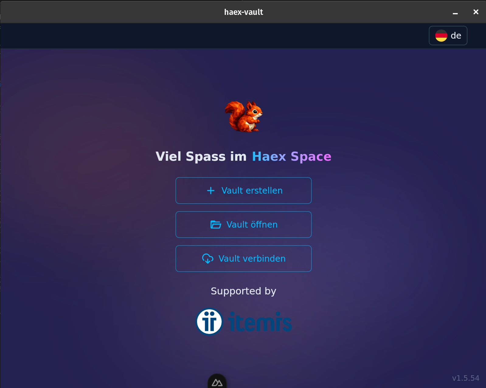
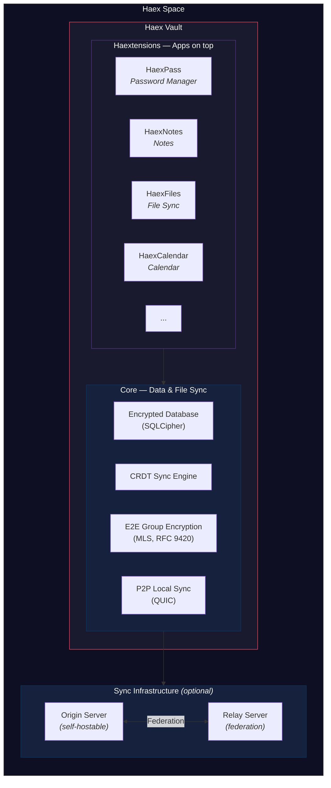
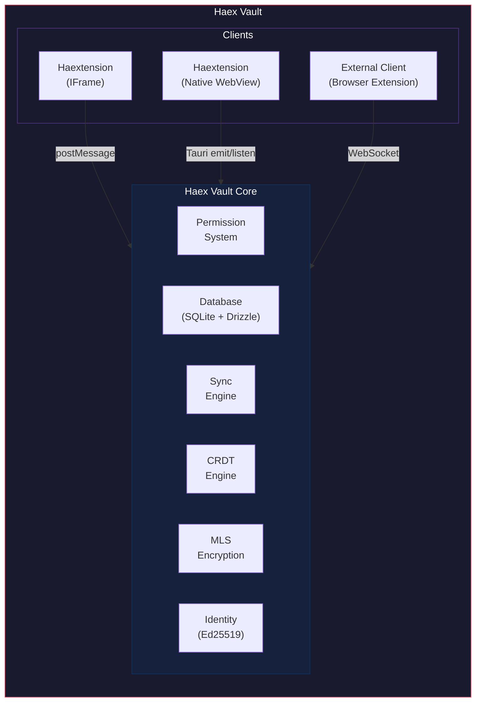
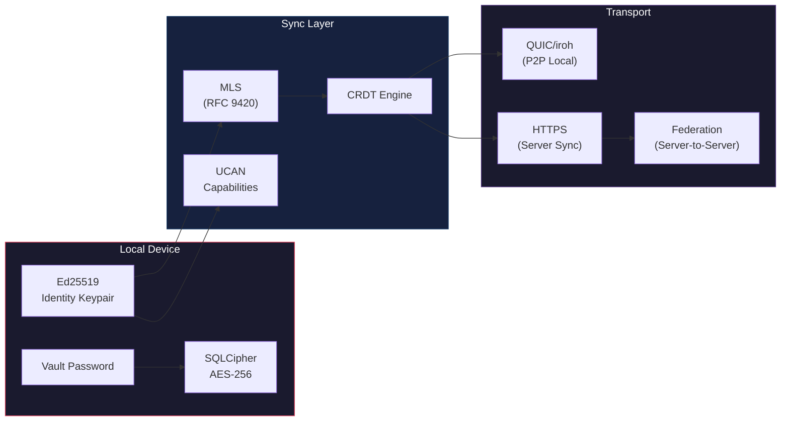
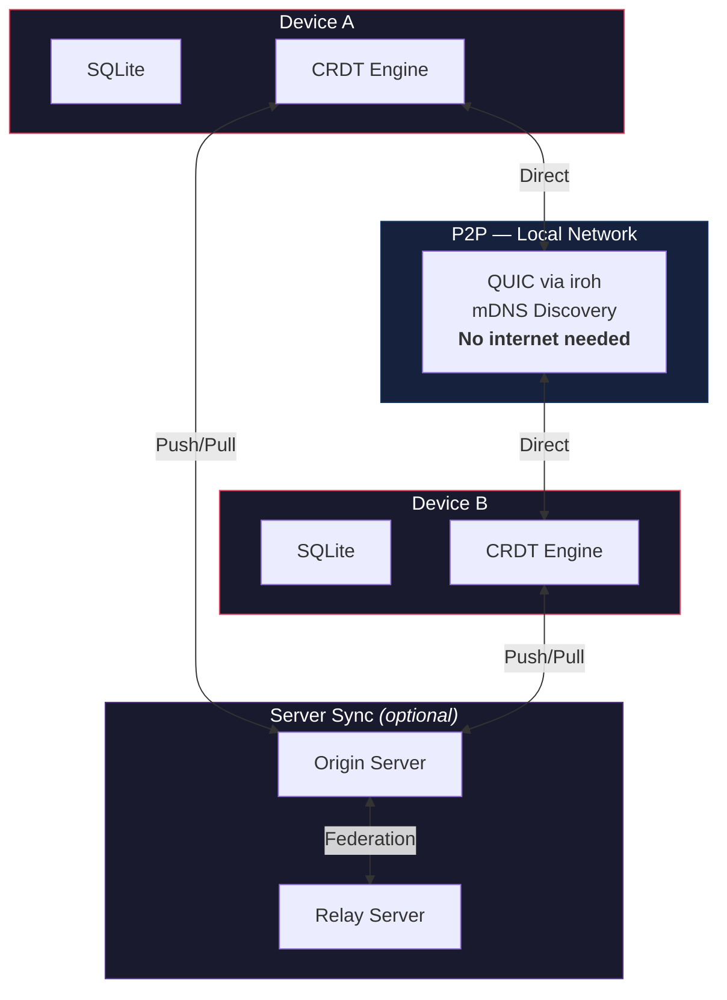
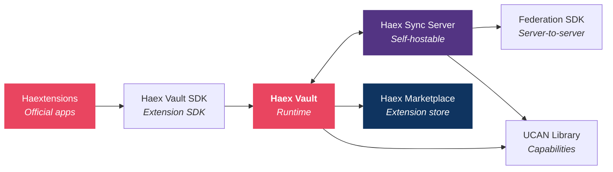

# Haex Vault

**Your data. Your devices. Your rules.**

Sync your data and files across all your devices — and share them with friends, family, or colleagues. Everything end-to-end encrypted. No cloud lock-in. No vendor dependency.

<p align="center">
  
  
</p>

---

## The Idea

Your digital life shouldn't depend on which device or platform you use. Whether it's your Android phone, your Windows work PC, or your Linux laptop — your data, your files, and your applications should just work. Everywhere. Automatically.

**Haex Space** is an ecosystem that abstracts away devices and platforms. Haex Vault is its core — a local-first runtime that keeps everything in sync across all your devices, end-to-end encrypted. On top of that, [Haextensions](#haextensions) bring you applications like a password manager, a note-taking app, or a file sync — all running inside Haex Vault, available on every platform, with zero setup.

No golden cage. No walled garden. Just digital sovereignty.


```mermaid
graph TB
    subgraph ecosystem["Haex Space"]
        direction TB

        subgraph vault["Haex Vault"]
            direction TB

            subgraph core["Core — Data & File Sync"]
                db["Encrypted Database<br/>(SQLCipher)"]
                crdt["CRDT Sync Engine"]
                mls["E2E Group Encryption<br/>(MLS, RFC 9420)"]
                p2p["P2P Local Sync<br/>(QUIC)"]
            end

            subgraph apps["Haextensions — Apps on top"]
                pass["HaexPass<br/><i>Password Manager</i>"]
                notes["HaexNotes<br/><i>Notes</i>"]
                files["HaexFiles<br/><i>File Sync</i>"]
                calendar["HaexCalendar<br/><i>Calendar</i>"]
                more["..."]
            end

            apps --> core
        end

        subgraph infra["Sync Infrastructure <i>(optional)</i>"]
            origin["Origin Server<br/><i>(self-hostable)</i>"]
            relay["Relay Server<br/><i>(federation)</i>"]
            origin <-->|"Federation"| relay
        end

        core --> infra
    end

    style vault fill:#1a1a2e,stroke:#e94560,color:#fff
    style core fill:#16213e,stroke:#0f3460,color:#fff
    style apps fill:#1a1a2e,stroke:#533483,color:#fff
    style infra fill:#16213e,stroke:#0f3460,color:#fff
    style ecosystem fill:#0f0f23,stroke:#333,color:#fff
```

---

## What Haex Vault Does

At its core, Haex Vault syncs your encrypted data across devices — without conflicts, without a server requirement, and without anyone being able to read your data.

| Feature | Description |
|---------|-------------|
| **Encrypted database** | All data stored locally in SQLCipher (AES-256) |
| **Conflict-free sync** | CRDT-based — works offline, merges automatically |
| **P2P local sync** | Device-to-device via QUIC — no internet needed |
| **Server sync** | Push/pull to self-hosted servers — optional |
| **E2E encrypted sharing** | Share spaces with others using MLS (RFC 9420) |
| **Federation** | Cross-server collaboration with zero-trust DID authentication |
| **Haextensions** | Installable apps that run on top of the sync layer |
| **External API** | WebSocket bridge for browser extensions and other clients |

---

## No Internet Required

Haex Vault is **fully offline-capable**. Not just for reading — for everything, including sync.

Devices on the same local network discover each other via mDNS and sync directly over QUIC. No server. No internet. No account. Just your devices, talking to each other.

A sync server is entirely optional — useful if you want to sync across networks or share spaces with others, but never required to get started.

---

## For Users

**Your data, your control**
Everything is stored locally, encrypted with AES-256. You decide if, how, and where to sync.

**Share with anyone**
Create shared spaces for friends, family, or teams. All data is end-to-end encrypted using MLS (RFC 9420). The sync server facilitates delivery but cannot read your data — with the exception of metadata needed for efficient sync: CRDT columns, table names, timestamps, and primary keys (which is why generated UUIDs should always be used).

**Sync everywhere**
Use Haex Vault on as many devices as you want. Changes merge automatically. Sync locally via P2P or through your own server — or both.

**Federation**
Your data lives on your server. Collaborators access it through their own server, which relays requests transparently. No one needs an account on anyone else's server.

**Biometric unlock**
On Android and iOS, unlock your vault with fingerprint or face recognition.

**Browser integration**
Browser extensions connect to Haex Vault via WebSocket — e.g. [HaexPass Browser](https://github.com/haex-space/haextension) for password autofill.

---

## Haextensions

Haextensions are applications that run inside Haex Vault. They get the sync layer, encryption, permissions, and cross-platform support for free — developers just build a web app.

All official Haextensions are open source and available in the [haextension repository](https://github.com/haex-space/haextension).

| Haextension | Description | Status |
|-------------|-------------|--------|
| [**HaexPass**](https://github.com/haex-space/haextension/tree/main/apps/haex-pass) | Password manager with TOTP, Passkeys, KeePass import, and [browser extension](https://addons.mozilla.org/firefox/addon/haexpass/) | Stable |
| [**HaexNotes**](https://github.com/haex-space/haextension/tree/main/apps/haex-notes) | Note-taking app | Stable |
| [**HaexFiles**](https://github.com/haex-space/haextension/tree/main/apps/haex-files) | E2E-encrypted file sync (S3, R2, MinIO) | In Development |
| [**HaexCalendar**](https://github.com/haex-space/haextension/tree/main/apps/haex-calendar) | Calendar | Stable |
| [**HaexDraw**](https://github.com/haex-space/haextension/tree/main/apps/haex-draw) | Drawing/whiteboard app | Stable |
| [**HaexCode**](https://github.com/haex-space/haextension/tree/main/apps/haex-code) | Code editor | Stable |
| [**HaexImage**](https://github.com/haex-space/haextension/tree/main/apps/haex-image) | Image viewer/manager | Stable |

---

## For Developers

### The Key Benefit

You get the power of a **distributed SQL application** that syncs across any number of clients and users — without having to deal with CRDTs, merge conflicts, encryption, or sync logic.

**Haex Vault handles that for you.**

### What you write

A web app. With Vue, React, Svelte, or whatever you prefer.

### What you get

- **All platforms**: Windows, macOS, Linux, Android, iOS — one codebase
- **Native APIs**: Filesystem, SQLite database, shell, notifications, S3 storage
- **Automatic sync**: Save to the database, Haex Vault synchronizes — even offline via P2P
- **E2E encryption**: Local encryption and end-to-end encrypted sync between devices and users
- **Shared spaces**: Multi-user collaboration with MLS group encryption
- **External API**: Expose methods to browser extensions and other clients via WebSocket

### Architecture


```mermaid
graph TB
    subgraph vault["Haex Vault"]
        direction TB

        subgraph clients["Clients"]
            ext["Haextension<br/>(IFrame)"]
            extWv["Haextension<br/>(Native WebView)"]
            extClient["External Client<br/>(Browser Extension)"]
        end

        ext -->|postMessage| core
        extWv -->|"Tauri emit/listen"| core
        extClient -->|WebSocket| core

        subgraph core["Haex Vault Core"]
            direction LR
            permissions["Permission<br/>System"]
            database["Database<br/>(SQLite + Drizzle)"]
            syncEngine["Sync<br/>Engine"]
            crdtEngine["CRDT<br/>Engine"]
            mlsEngine["MLS<br/>Encryption"]
            identity["Identity<br/>(Ed25519)"]
        end
    end

    style vault fill:#1a1a2e,stroke:#e94560,color:#fff
    style core fill:#16213e,stroke:#0f3460,color:#fff
    style clients fill:#1a1a2e,stroke:#533483,color:#fff
```

### Haextension API

Haextensions run in an isolated IFrame (or native WebView on desktop) and communicate via the [Haex Vault SDK](https://github.com/haex-space/haex-vault-sdk):

```typescript
import { useHaexVault } from '@haex-space/vault-sdk'

const client = useHaexVault()

// Database — tables are namespaced: {publicKey}__{extensionName}__{tableName}
const results = await client.db.selectAsync({
  sql: 'SELECT * FROM items WHERE group_id = ?',
  params: [groupId]
})

// Filesystem
const files = await client.filesystem.readDirAsync('/documents')

// S3/Object Storage
await client.storage.upload(backendId, key, data)
```

> **Note:** Haextensions can only access their own namespaced tables. System tables (`haex_*`) are never accessible to extensions.

### External API (WebSocket)

Haextensions can expose methods to external clients. For example, the [HaexPass browser extension](https://github.com/haex-space/haextension/tree/main/apps/haex-pass-browser) uses this to provide autofill:

```typescript
// Browser extension connects to Haex Vault
const ws = new WebSocket('ws://localhost:19455')
ws.send(JSON.stringify({
  action: 'external-request',
  extension: 'haex-pass',
  method: 'get-items',
  params: { url: 'https://example.com' }
}))
```

### Table Naming & Sync

Extension tables are namespaced and support opt-out from CRDT sync:

| Table Name | Synced | Description |
|------------|--------|-------------|
| `{key}__myapp__settings` | Yes | Synced between devices |
| `{key}__myapp__cache_no_sync` | No | Local-only, `_no_sync` suffix opts out |

The CRDT engine automatically adds sync columns (`haex_timestamp`, `haex_column_hlcs`, `haex_tombstone`) to all tables without the `_no_sync` suffix.

---

## Security Architecture


```mermaid
graph LR
    subgraph local["Local Device"]
        vault_pw["Vault Password"]
        sqlcipher["SQLCipher<br/>AES-256"]
        ed25519["Ed25519<br/>Identity Keypair"]
    end

    subgraph sync_layer["Sync Layer"]
        crdt["CRDT Engine"]
        mls["MLS<br/>(RFC 9420)"]
        ucan["UCAN<br/>Capabilities"]
    end

    subgraph transport["Transport"]
        quic["QUIC/iroh<br/>(P2P Local)"]
        https["HTTPS<br/>(Server Sync)"]
        federation["Federation<br/>(Server-to-Server)"]
    end

    vault_pw --> sqlcipher
    ed25519 --> mls
    ed25519 --> ucan
    mls --> crdt
    crdt --> quic & https
    https --> federation

    style local fill:#1a1a2e,stroke:#e94560,color:#fff
    style sync_layer fill:#16213e,stroke:#0f3460,color:#fff
    style transport fill:#1a1a2e,stroke:#533483,color:#fff
```

### Local Encryption

The entire SQLite database is encrypted with **SQLCipher (AES-256)**.

### Sync Encryption

All row payloads are **end-to-end encrypted** before leaving the device. The sync server can see metadata needed for efficient change tracking — CRDT columns, table names, timestamps, and primary keys — but never the actual content of your data.

### Shared Spaces (MLS)

Shared spaces use **MLS (Messaging Layer Security, RFC 9420)** for group key management:

- Each device has an Ed25519 identity keypair
- MLS manages group membership and key rotation
- UCAN tokens provide capability-based authorization
- Forward secrecy through epoch-based key derivation

### Federation

Server-to-server communication uses a **zero-trust model**:

- DID-based identity (`did:web`)
- Ed25519 request signatures
- Delegated UCAN tokens for relay authorization
- Request body hashing prevents tampering

---

## Synchronization


```mermaid
graph TB
    subgraph device_a["Device A"]
        db_a["SQLite"]
        crdt_a["CRDT Engine"]
    end

    subgraph device_b["Device B"]
        db_b["SQLite"]
        crdt_b["CRDT Engine"]
    end

    subgraph p2p["P2P — Local Network"]
        quic["QUIC via iroh<br/>mDNS Discovery<br/><b>No internet needed</b>"]
    end

    subgraph server_sync["Server Sync <i>(optional)</i>"]
        origin["Origin Server"]
        relay["Relay Server"]
    end

    crdt_a <-->|"Direct"| quic
    quic <-->|"Direct"| crdt_b
    crdt_a <-->|"Push/Pull"| origin
    crdt_b <-->|"Push/Pull"| origin
    origin <-->|"Federation"| relay

    style device_a fill:#1a1a2e,stroke:#e94560,color:#fff
    style device_b fill:#1a1a2e,stroke:#e94560,color:#fff
    style p2p fill:#16213e,stroke:#0f3460,color:#fff
    style server_sync fill:#1a1a2e,stroke:#533483,color:#fff
```

- **Offline-first**: Changes are stored locally, synced when a path is available
- **Conflict-free**: Automatic merging without data loss using column-level HLCs
- **P2P local sync**: Direct device-to-device via QUIC with mDNS — no internet, no server
- **Server sync**: Optional push/pull to self-hosted origin servers
- **Federation**: Cross-server relay — your data stays on your server, collaborators reach it through theirs

---

## Tech Stack

| Layer | Technology |
|-------|-----------|
| **Runtime** | [Tauri 2](https://tauri.app) (Rust backend, native WebViews) |
| **Frontend** | Vue 3, TypeScript, Nuxt UI |
| **Database** | SQLite with SQLCipher (AES-256) |
| **ORM** | Drizzle ORM |
| **Sync** | Custom CRDT engine with Hybrid Logical Clocks |
| **Group Encryption** | OpenMLS (RFC 9420) |
| **Identity** | Ed25519 (ed25519-dalek) |
| **Key Exchange** | X25519 (x25519-dalek) |
| **Authorization** | UCAN capability tokens |
| **P2P Transport** | iroh (QUIC) with mDNS |
| **External API** | WebSocket (tokio-tungstenite) |
| **Storage Backends** | S3, Supabase Storage |
| **Biometric Auth** | Android KeyStore / iOS Keychain |

---

## Installation

### Downloads

Pre-built binaries: [Releases](https://github.com/haex-space/haex-vault/releases)

### Building from source

**Prerequisites:**
- [Node.js](https://nodejs.org/) + pnpm
- [Rust](https://www.rust-lang.org/tools/install)
- [Tauri Prerequisites](https://tauri.app/start/prerequisites/)

**Linux (Debian/Ubuntu):**
```bash
sudo apt install libwebkit2gtk-4.1-dev libgtk-3-dev libayatana-appindicator3-dev librsvg2-dev
```

**Linux (Fedora):**
```bash
sudo dnf install webkit2gtk4.1-devel gtk3-devel libappindicator-gtk3 librsvg2-devel
```

**Development:**
```bash
git clone https://github.com/haex-space/haex-vault.git
cd haex-vault
pnpm install
pnpm tauri dev
```

**Testing:**
```bash
pnpm test              # Unit tests (Vitest)
pnpm test:e2e          # E2E tests (Playwright)
```

---

## Ecosystem


```mermaid
graph LR
    vault["<b>Haex Vault</b><br/><i>Runtime</i>"]
    sdk["Haex Vault SDK<br/><i>Extension SDK</i>"]
    haextensions["Haextensions<br/><i>Official apps</i>"]
    sync["Haex Sync Server<br/><i>Self-hostable</i>"]
    marketplace["Haex Marketplace<br/><i>Extension store</i>"]
    federation["Federation SDK<br/><i>Server-to-server</i>"]
    ucan["UCAN Library<br/><i>Capabilities</i>"]

    sdk --> vault
    haextensions --> sdk
    vault <--> sync
    vault --> marketplace
    sync --> federation
    sync --> ucan
    vault --> ucan

    style vault fill:#e94560,stroke:#e94560,color:#fff
    style haextensions fill:#e94560,stroke:#e94560,color:#fff
    style sync fill:#533483,stroke:#533483,color:#fff
    style marketplace fill:#0f3460,stroke:#0f3460,color:#fff
```

| Project | Description |
|---------|-------------|
| [**Haex Vault**](https://github.com/haex-space/haex-vault) | The runtime (this repo) |
| [**Haextensions**](https://github.com/haex-space/haextension) | Official apps (HaexPass, HaexNotes, HaexFiles, ...) |
| [**Haex Vault SDK**](https://github.com/haex-space/haex-vault-sdk) | SDK for Haextension developers |
| [**Haex Sync Server**](https://github.com/haex-space/haex-sync-server) | Self-hostable sync server (Hono + Drizzle + PostgreSQL) |
| [**Haex Marketplace**](https://github.com/haex-space/haex-marketplace) | Discover and publish Haextensions |
| [**Federation SDK**](https://github.com/haex-space/haex-federation-sdk) | Zero-trust DID-based server-to-server authentication |
| [**UCAN Library**](https://github.com/haex-space/haex-ucan) | Capability-based authorization tokens |

---

## Platforms

| Platform | Status |
|----------|--------|
| Linux | Stable |
| Windows | Stable |
| macOS | Stable |
| Android | Stable |
| iOS | Planned |

---

## License

[MIT](LICENSE)
